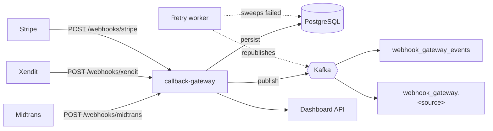

<div align="center">

# 🪝 callback-gateway

**One endpoint for every payment gateway's webhook. Persist first, publish to Kafka, never lose a callback.**

[](go.mod)
[](https://github.com/golangid/candi)
[](https://kafka.apache.org/)
[](https://www.postgresql.org/)
[](#license)

</div>

---

## Why this exists

Every payment gateway — Midtrans, Xendit, Stripe, whatever comes next — has its own webhook shape, its own retry
behavior, and its own way of ruining your day when its callback silently gets dropped. `callback-gateway` puts one
durable, boring endpoint in front of all of them:

> **receive → persist → publish → track → self-heal**

so the rest of your system never has to trust a payment gateway's delivery guarantees again.

## ✨ What it does

| Step | Behavior |
|------|----------|
| **Receive** | `POST /webhooks/:source` accepts *any* gateway — `/webhooks/midtrans`, `/webhooks/xendit`, `/webhooks/stripe`, `/webhooks/anything` |
| **Persist** | Source, method, endpoint, headers, query params, raw body, client IP — saved **before** anything else happens, so nothing is lost even if Kafka is down |
| **Publish** | Every event fans out to Kafka on two topics: `webhook_gateway_events` (firehose, everything) and `webhook_gateway.<source>` (per-gateway) |
| **Track** | A dashboard REST API for listing, filtering, inspecting, replaying, and bulk-retrying every event that's ever come in |
| **Self-heal** | A background worker sweeps anything stuck in `failed` publish status and retries it automatically |

## 🏗️ Architecture

Built as a clean-architecture module, following the same convention used by
[candi](https://github.com/golangid/candi)-based services: each business capability is self-contained under
`internal/modules/<name>` with `domain / repository / usecase / delivery` layers, wired together in `module.go`
and mounted by `cmd/.../main.go`.

```
main.go                            entrypoint (candi app runner, graceful shutdown)
configs/                           candi dependency wiring (SQL, Kafka broker, validator) + app factory
internal/service.go                candi service: modules + REST/cron applications
internal/modules/webhook/
  domain/                          filters, requests, responses, errors
  repository/                      storage interfaces + Postgres/GORM impl
  usecase/                         ingest / list / detail / replay / retry / topic routing logic
  delivery/resthandler/            HTTP handlers (ingestion + dashboard)
  delivery/workerhandler/          cron jobs: retry failed publishes, refresh topic routes
  module.go                        assembles the module
pkg/shared/                        env, shared DB models (domain/), shared repository + usecase registries
pkg/verifier/                      optional per-source signature/token verification
cmd/migration/                     goose SQL migrations (`make migration`)
deployments/Dockerfile
docker-compose.yaml                app + frontend (points at your existing Postgres/Kafka)
api/openapi.yaml                   API spec for the dashboard frontend
frontend/                          Next.js + shadcn/ui analytics dashboard (see frontend/README.md)
```



> Built on the [candi](https://github.com/golangid/candi) runtime (REST server, cron workers, Kafka broker), with
> `gorm` for Postgres. Add further modules with `candi add module`.

## 🚀 Getting started

Requires an existing Postgres database and Kafka-compatible broker (this repo doesn't bundle either).

```bash
cp .env.sample .env      # point SQL_DB_*_DSN / KAFKA_BROKERS at your existing servers
make migration           # create/upgrade tables (goose)
go mod tidy               # fetch dependencies, generate go.sum
go run .
```

Or run everything (app + frontend) via Docker — `docker-compose.yaml` reads the same `.env` at the project root:

```bash
docker compose up --build
```

> Postgres/Kafka running on the Docker host itself rather than a remote server? Use `host.docker.internal` instead
> of `localhost` for `SQL_DB_*_DSN` / `KAFKA_BROKERS` so the container can reach them.

Health check: `GET /healthz`

## 🧪 Sending a test webhook

```bash
curl -X POST http://localhost:8090/webhooks/midtrans \
  -H "Content-Type: application/json" \
  -d '{"order_id":"ORDER-123","transaction_status":"settlement","gross_amount":"100000.00"}'
```

Any `source` you haven't configured a verifier for (see below) is accepted as-is — handy for `/webhooks/dummy`
style sampling during local development.

## 📊 Dashboard API

| Method | Path                                | Purpose                                   |
|--------|--------------------------------------|--------------------------------------------|
| GET    | `/dashboard/webhooks`                | List events (filter: source, status, event_type, q, from, to; paginated) |
| GET    | `/dashboard/webhooks/:id`            | Full detail: headers, raw body, Kafka outcome |
| GET    | `/dashboard/webhooks/sources`        | Distinct sources seen, with counts        |
| GET    | `/dashboard/webhooks/stats`          | Aggregate counts by source/status/day     |
| POST   | `/dashboard/webhooks/:id/replay`     | Re-publish one event's stored body to Kafka |
| POST   | `/dashboard/webhooks/retry-failed`   | Bulk retry every `failed` event           |
| GET/POST | `/dashboard/topic-routes`          | List / create Kafka topic route overrides |
| PUT/DELETE | `/dashboard/topic-routes/:id`    | Update / delete a topic route             |
| POST   | `/auth/login`                        | Exchange dashboard username/password for a session token |
| GET    | `/auth/status`                       | Whether login is enabled / session is valid |

Full request/response shapes: [`api/openapi.yaml`](api/openapi.yaml).

Set `DASHBOARD_API_KEY` in `.env` to require an `X-API-Key` header on all `/dashboard/*` routes (left open by
default for local development).

Alternatively set `DASHBOARD_USERNAME` and `DASHBOARD_PASSWORD` to enable a login page: the frontend signs in via
`POST /auth/login` and `/dashboard/*` then requires the issued session token. Set `DASHBOARD_AUTH_SECRET` to a long
random string so sessions survive restarts, and `DASHBOARD_SESSION_TTL` (default `24h`) to control expiry.

### 🧭 Topic routing

Events go to `webhook_gateway.<source>` by default. Per-source overrides can be managed at runtime from the
dashboard's **Topics** page (or `/dashboard/topic-routes`); a cron job refreshes the cached routes.

### 📖 Interactive API docs (Swagger UI)

The spec in `api/openapi.yaml` is embedded into the binary and served live:

- `GET /docs` — Swagger UI, browse and try every endpoint from the browser
- `GET /openapi.yaml` — the raw OpenAPI spec

```
http://localhost:8090/docs
```

Editing `api/openapi.yaml` and restarting the service is all it takes to update the docs — no codegen step.

### 🖥️ Dashboard frontend

A ready-to-run dashboard lives in [`frontend/`](frontend/) (Next.js + shadcn/ui): analytics overview with charts,
a filterable/paginated event table with replay & bulk-retry, a sources breakdown, topic route management, a login page, and a settings page to point it
at any backend URL/API key.

```bash
cd frontend
cp .env.local.example .env.local
npm install
npm run dev   # http://localhost:3000
```

## 🔐 Optional: verifying gateway signatures

Per-source signature/token verification can be enabled via env vars (`WEBHOOK_VERIFY_<SOURCE>_MODE/HEADER/SECRET`
— see [`.env.sample`](.env.sample) for examples). A source with nothing configured is ingested and published as
usual; `signature_verified` on the stored record will just be `null` ("not checked") instead of `true`/`false`.

## 📨 Consuming the Kafka events from another service

Message value is JSON:

```json
{
  "id": "c2b1...-uuid",
  "source": "midtrans",
  "event_type": "settlement",
  "received_at": "2026-09-23T10:00:00Z",
  "endpoint": "/webhooks/midtrans",
  "signature_verified": true,
  "headers": { "...": "..." },
  "body": { "...": "the exact payload the gateway sent" }
}
```

Subscribe to `webhook_gateway_events` for everything, or `webhook_gateway.<source>` for just one gateway.

## 🛠️ Makefile shortcuts

```bash
make run          # go run .
make build        # build to ./bin/webhook-middleware
make tidy         # go mod tidy
make fmt          # gofmt -w .
make test         # go test ./...
make docker-up    # docker compose up --build
make docker-down  # docker compose down -v
```

## License

MIT
